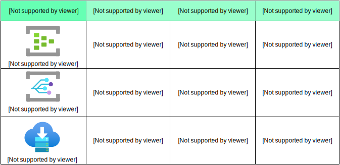

# AZ-204
My studying notes for AZ-204 - Developing Solutions for Microsoft Azure


## Lab List
Lab 01: Build a web application on Azure platform as a service offering (DONE)

Lab 02: Implement task processing logic by using Azure Functions (DONE)

Lab 03: Retrieve Azure Storage resources and metadata by using the Azure Storage SDK for .NET (DONE)

Lab 04: Construct a polyglot (CosmosDb) data solution (DONE)

Lab 05: Deploy compute workloads by using images and containers (DONE)

Lab 06: Authenticate by using OpenID Connect, MSAL, and .NET SDKs (DONE)

Lab 07: Access resource secrets more securely across services **

Lab 08: Create a multi-tier solution by using Azure services (APIM) (DONE)

Lab 09: Publish and subscribe to Event Grid events (DONE)

Lab 10: Asynchronously process messages by using Azure Service Bus Queues (DONE) --> Similar to Rabbitmq

Lab 11: Monitor services that are deployed to Azure **

Lab 12: Enhance a web application by using the Azure Content Delivery Network (DONE)


## Azure Messaging Services



## Managed Identities

A managed identity from Azure Active Directory (Azure AD) allows your app to easily access other Azure AD-protected resources such as Azure Key Vault. The identity is managed by the Azure platform and does not require you to provision or rotate any secrets. For more about managed identities in Azure AD, see Managed identities for Azure resources.

Your application can be granted two types of identities:

- A system-assigned identity is tied to your application and is deleted if your app is deleted. An app can only have one system-assigned identity.
- A user-assigned identity is a standalone Azure resource that can be assigned to your app. An app can have multiple user-assigned identities.

https://learn.microsoft.com/en-us/azure/app-service/overview-managed-identity?tabs=portal%2Chttp


## Additional labs:
- Event Hub (high volume / data streaming)
- ??

## Commands

#### install azure-cli on mac

```
brew update && brew install azure-cli
```

#### Deploying Web app using a zip file

```
az login

az webapp list --resource-group az-204

//go to web app source code (.zip file)

cd API
az webapp deployment source config-zip --resource-group az-204 --src api.zip --name imgapifelipecembranelli


cd Web/
az webapp deployment source config-zip --resource-group az-204 --src web.zip --name imgwebfelipecembranelli
```

### Azure functions

```
brew tap azure/functions
brew install azure-functions-core-tools@4
# if upgrading on a machine that has 2.x or 3.x installed:
brew link --overwrite azure-functions-core-tools@4
```

```
func init --worker--runtime dotnet --force
dotnet build
func new --template "HTTP trigger" --name "Echo"
func start --build
func azure functionapp publish funclogicfeliperc
```

```
// install httprepl (to run azure function locally)
dotnet tool install -g Microsoft.dotnet-httprepl
httprepl http://localhost:7071
```


#### Verifying current azure account
```
az account show
```

## Creating Virtual Machine

### Create resource group
```
az group create -l westus -n rg-az-204
```

### Create vm
```
az vm create --resource-group rg-az-204 --name quickvm --image Debian --admin-username student --admin-password [xxxx]

az vm show --resource-group ContainerCompute --name quickvm

Run the following command to list all the IP addresses associated with the VM:

az vm list-ip-addresses --resource-group ContainerCompute --name quickvm

Run the following command to filter the output to only return the first IP address value:

az vm list-ip-addresses --resource-group ContainerCompute --name quickvm --query '[].{ip:virtualMachine.network.publicIpAddresses[0].ipAddress}' --output tsv

Run the following command to store the results of the previous command in a new Bash shell variable named ipAddress:

ipAddress=$(az vm list-ip-addresses --resource-group rg-az-204 --name quickvm --query '[].{ip:virtualMachine.network.publicIpAddresses[0].ipAddress}' --output tsv)
```

### Creating container registry
```
registryName=conregistry$RANDOM

az acr check-name --name $registryName

az acr create --resource-group rg-az-204 --name $registryName --sku Basic

Run the following command to upload the source code to your container registry and build the container image as a Container Registry task:

az acr build --registry conregistry28829 --image ipcheck:latest .
```


#### Resources clean up
```
az group delete --name rg-az-204 --no-wait --yes
```


## References

[Microsoft Certifications - AZ-204](https://docs.microsoft.com/en-us/learn/certifications/exams/az-204)

[Microsoft Learning Labs - AZ-204](https://microsoftlearning.github.io/AZ-204-DevelopingSolutionsforMicrosoftAzure)

[Study Guide by Thomas Maurer](https://www.thomasmaurer.ch/2020/03/az-204-study-guide-developing-solutions-for-microsoft-azure)

[Microsoft Learn Modules Collection](https://docs.microsoft.com/en-us/users/rishanthakumar/collections/m1w6in77yweer1)

[Exam Ref AZ-204 Developing Solutions for Microsoft Azure Paperback](https://www.amazon.co.uk/AZ-204-Developing-Solutions-Microsoft-Azure/dp/0136798330)

[Mind maps](https://github.com/felipecembranelli/AZ-204-Mindmap)

